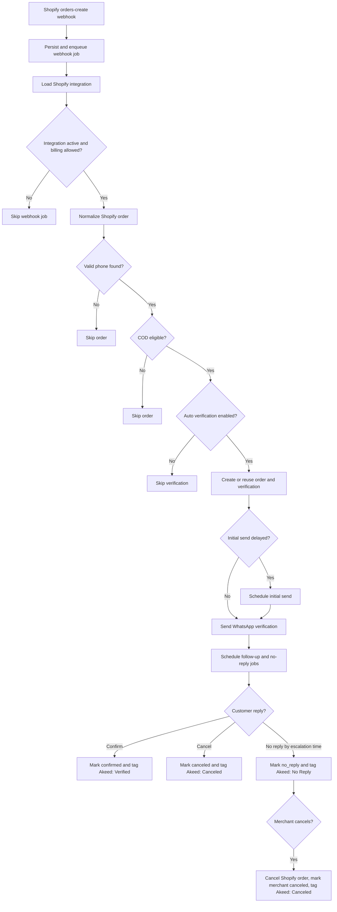

# Order Confirmation Workflow And Controls

Last updated: 2026-04-30

## Purpose

This document explains the Akeed cash-on-delivery order confirmation feature from both a business and code perspective. It covers the order lifecycle, merchant controls, backend services, frontend screens, data model, API contracts, and operational behavior.

The feature verifies COD Shopify orders through WhatsApp before the merchant fulfills the order. Customers can confirm or cancel from a WhatsApp template. If they do not reply, Akeed can escalate the order to `no_reply`, tag the Shopify order, and let the merchant cancel it from the Akeed dashboard.

## Scope

In scope:

- Shopify `orders-create` webhook ingestion.
- COD eligibility filtering.
- Auto-verification enable/disable control.
- Initial WhatsApp verification message.
- Optional delayed initial send.
- Optional follow-up message.
- Quiet-hours scheduling.
- No-reply escalation.
- Customer confirm/cancel replies.
- Shopify order tagging.
- Merchant cancellation for `no_reply` orders.
- Dashboard KPIs, filters, actions, and settings controls.
- Billing usage consumption for verification sends.

Out of scope:

- Creating Shopify orders before checkout submission.
- Automatically canceling Shopify orders on a customer cancel reply. The current customer cancel flow marks and tags the order, but does not call Shopify order cancellation.
- Multi-platform order support beyond the currently implemented Shopify strategy.

## Business Workflow



## Lifecycle States

| Status      | Meaning                                                                            | Main writer                                         |
| ----------- | ---------------------------------------------------------------------------------- | --------------------------------------------------- |
| `pending`   | Verification record exists, but the first WhatsApp template has not been sent yet. | `VerificationHubService`                            |
| `sent`      | Initial WhatsApp verification template was sent successfully.                      | `VerificationSendService`                           |
| `delivered` | Meta reported delivery for the current WhatsApp message id.                        | `WhatsAppWebhookService`                            |
| `read`      | Meta reported the message was read.                                                | `WhatsAppWebhookService`                            |
| `confirmed` | Customer pressed the confirm button.                                               | `WhatsAppWebhookService`                            |
| `canceled`  | Customer canceled or merchant canceled after no reply.                             | `WhatsAppWebhookService`, `VerificationsService`    |
| `no_reply`  | Customer did not respond before the escalation job fired.                          | `VerificationAutomationProcessor`                   |
| `failed`    | Initial send failed or plan limit blocked the initial send.                        | `VerificationSendService`, `VerificationHubService` |
| `expired`   | Reserved enum value for lifecycle compatibility.                                   | Not actively automated in this workflow             |

Protected behavior:

- Terminal statuses `confirmed` and `canceled` are not overwritten by later status webhooks.
- `no_reply` is protected from late delivery/read/failed webhooks.
- A customer reply can still override `no_reply` if the merchant has not already canceled the order.
- If `merchantCanceledAt` is set, later customer replies are ignored.

## Merchant Controls

Controls are edited from the Settings page and persisted on the `integrations` table through `PATCH /api/onboarding/settings`.

| Control                  |            Default | Validation                                 | Business behavior                                                                                                     |
| ------------------------ | -----------------: | ------------------------------------------ | --------------------------------------------------------------------------------------------------------------------- |
| `isAutoVerifyEnabled`    |             `true` | Boolean                                    | If disabled, new eligible COD orders are not stored or verified by `handleNewOrder`.                                  |
| `sendDelayMinutes`       |                `0` | `0..1440`                                  | Delays the initial WhatsApp send. Billing is not consumed until the delayed send executes.                            |
| `followUpEnabled`        |             `true` | Boolean                                    | Enables one follow-up message when the customer has not replied.                                                      |
| `followUpDelayMinutes`   |              `120` | `0..10080`                                 | Follow-up delay from the initial successful send time. Must be lower than escalation delay when follow-up is enabled. |
| `escalationDelayMinutes` |              `360` | `0..10080`                                 | No-reply escalation delay from the initial successful send time. `0` disables escalation scheduling.                  |
| `quietHoursEnabled`      |            `false` | Boolean                                    | When enabled, delayed automation jobs are moved outside quiet hours.                                                  |
| `quietHoursStart`        | UI default `21:00` | `HH:mm`, required when quiet hours enabled | Start of quiet-hours window in the configured timezone.                                                               |
| `quietHoursEnd`          | UI default `09:00` | `HH:mm`, required when quiet hours enabled | End of quiet-hours window in the configured timezone.                                                                 |
| `timezone`               |      `Asia/Riyadh` | Allowlist in `AUTOMATION_TIMEZONES`        | Timezone used for quiet-hours calculations.                                                                           |
| `defaultLanguage`        |             `auto` | `auto`, `en`, `ar`                         | WhatsApp template language. `auto` resolves Arabic for Arabic-region phone prefixes and English otherwise.            |
| `shippingCurrency`       |              `USD` | Allowlist                                  | Used for dashboard savings display, not verification routing.                                                         |
| `avgShippingCost`        |                `3` | Number `>= 0`, max 2 decimals              | Used for dashboard money-saved KPI.                                                                                   |

Cross-field rules:

- If follow-up is enabled, `followUpDelayMinutes < escalationDelayMinutes`.
- If quiet hours are enabled, both `quietHoursStart` and `quietHoursEnd` are required.
- Frontend validation mirrors backend validation before calling the API.

## Backend Code Map

| Area                          | File                                                                                        | Responsibility                                                                                                                  |
| ----------------------------- | ------------------------------------------------------------------------------------------- | ------------------------------------------------------------------------------------------------------------------------------- |
| Shopify webhook controller    | `akeed-backend/src/infrastructure/spokes/shopify/shopify.controller.ts`                     | Receives `POST /webhooks/shopify/orders-create` and verifies Shopify HMAC through `ShopifyHmacGuard`.                           |
| Shopify webhook ingestion     | `akeed-backend/src/infrastructure/spokes/shopify/services/shopify-order-webhook.service.ts` | Fast path that persists/enqueues the webhook and returns `200`.                                                                 |
| Webhook queue processor       | `akeed-backend/src/modules/webhook-queue/webhook-queue.processor.ts`                        | Loads integration, checks billing block, normalizes order, and calls core verification logic.                                   |
| Shopify order normalizer      | `akeed-backend/src/modules/webhook-queue/normalizers/shopify-order.normalizer.ts`           | Extracts customer phone, order number, total, currency, and payment method from raw Shopify payload.                            |
| COD eligibility               | `akeed-backend/src/modules/verification-core/order-eligibility.service.ts`                  | Dispatches platform-specific eligibility strategy.                                                                              |
| Core orchestration            | `akeed-backend/src/modules/verification-core/verification-hub.service.ts`                   | Handles new orders, idempotency, delayed initial sends, immediate sends, follow-up/no-reply scheduling, and final Shopify tags. |
| WhatsApp sending              | `akeed-backend/src/modules/verification-core/verification-send.service.ts`                  | Reserves billing usage, sends the WhatsApp template, marks initial status, and releases usage on send failure.                  |
| Automation producer           | `akeed-backend/src/modules/verification-automation/verification-automation.producer.ts`     | Enqueues deterministic BullMQ jobs for initial, follow-up, and no-reply automation.                                             |
| Automation worker             | `akeed-backend/src/modules/verification-automation/verification-automation.processor.ts`    | Executes delayed initial sends, follow-ups, quiet-hours rescheduling, and no-reply escalation.                                  |
| WhatsApp adapter              | `akeed-backend/src/infrastructure/spokes/meta/whatsapp.service.ts`                          | Sends the `akeed_cod_verification` Meta template with confirm/cancel quick-reply payloads.                                      |
| WhatsApp webhook              | `akeed-backend/src/infrastructure/spokes/meta/whatsapp.webhook.service.ts`                  | Handles customer button replies and delivery/read/failed status webhooks.                                                       |
| Dashboard/verifications API   | `akeed-backend/src/modules/verifications/verifications.controller.ts`                       | Exposes stats, list, test send, and merchant no-reply cancellation endpoint.                                                    |
| Merchant cancellation service | `akeed-backend/src/modules/verifications/verifications.service.ts`                          | Cancels no-reply Shopify orders and updates local verification state.                                                           |
| Settings API                  | `akeed-backend/src/modules/onboarding/onboarding.controller.ts`                             | Exposes onboarding/settings state and updates.                                                                                  |
| Settings business rules       | `akeed-backend/src/modules/onboarding/onboarding-state.service.ts`                          | Persists merchant controls and enforces cross-field validation.                                                                 |

## Frontend Code Map

| Area                        | File                                                                                           | Responsibility                                                                                      |
| --------------------------- | ---------------------------------------------------------------------------------------------- | --------------------------------------------------------------------------------------------------- |
| Dashboard hook              | `akeed-frontend/src/features/dashboard/domain/useDashboard.ts`                                 | Loads stats/list data, handles filters, test sends, and cancel-order UI state.                      |
| Dashboard standalone skin   | `akeed-frontend/src/features/dashboard/skins/standalone/DashboardStandaloneSkin.tsx`           | Standalone dashboard page composition.                                                              |
| Dashboard embedded skin     | `akeed-frontend/src/features/dashboard/skins/embedded/DashboardEmbeddedSkin.tsx`               | Shopify embedded dashboard page composition.                                                        |
| Stats cards                 | `akeed-frontend/src/features/dashboard/skins/standalone/components/StandaloneStatsSummary.tsx` | Displays confirmed, canceled, awaiting response, reply rate, confirmation rate, usage, and savings. |
| Verification table          | `akeed-frontend/src/features/dashboard/skins/standalone/VerificationsTableStandalone.tsx`      | Shows verification rows and no-reply cancel action in standalone mode.                              |
| Embedded verification table | `akeed-frontend/src/features/dashboard/skins/embedded/VerificationsTableEmbedded.tsx`          | Shows verification rows and no-reply cancel action in embedded mode.                                |
| Settings hook               | `akeed-frontend/src/features/settings/domain/useSettings.ts`                                   | Loads/saves merchant controls, validates values, and handles billing plan actions.                  |
| Settings standalone skin    | `akeed-frontend/src/features/settings/skins/standalone/SettingsStandaloneSkin.tsx`             | Standalone settings UI and message preview.                                                         |
| Settings embedded skin      | `akeed-frontend/src/features/settings/skins/embedded/SettingsEmbeddedSkin.tsx`                 | Polaris settings UI and message preview.                                                            |
| Message preview             | `akeed-frontend/src/features/message-preview/`                                                 | Shows English/Arabic verification template preview.                                                 |
| API/auth wrapper            | `akeed-frontend/src/shared/lib/auth.ts`                                                        | Sends authenticated backend requests in standalone and embedded modes.                              |

## Backend Flow Details

### 1. Shopify Webhook Ingestion

Endpoint: `POST /webhooks/shopify/orders-create`

Processing:

- `ShopifyHmacGuard` verifies the raw Shopify HMAC before the controller handles the payload.
- `ShopifyOrderWebhookService.handleOrderCreate` enqueues the webhook via `WebhookQueueProducer`.
- The controller returns `200` quickly so Shopify does not time out.
- `webhook_events` stores idempotency and processing status.

Skip cases:

- Missing or inactive integration.
- Billing status is `cancelled`, `canceled`, `declined`, `expired`, or `frozen`.
- No normalizer is registered for the platform.
- Normalizer cannot produce a valid order, most commonly because no valid phone is found.

### 2. Order Normalization And Eligibility

`ShopifyOrderNormalizer` extracts:

- Shopify order id as `externalOrderId`.
- Shopify order number.
- Customer phone from order, customer, billing address, or shipping address.
- Customer name.
- Total price and currency.
- Payment method from `payment_gateway_names` or `gateway`.
- Raw payload for audit/debugging.

`OrderEligibilityService` then applies the Shopify COD strategy. Non-COD orders are skipped and no verification is created.

### 3. Auto-Verify Gate And Idempotency

`VerificationHubService.handleNewOrder` runs the main gate sequence:

1. Evaluate COD eligibility.
2. Stop if `integration.isAutoVerifyEnabled` is false.
3. Find or create the local `orders` row by `externalOrderId + orgId`.
4. Find an existing verification for the order.
5. Create a new `verifications` row with `status = pending` if no verification exists.

Idempotency is enforced by:

- Lookup by `orders.external_order_id + org_id`.
- One active verification per order through `unique_active_verification_per_order`.
- Deterministic BullMQ job ids for automation jobs.

### 4. Initial Send

Immediate path:

- If `sendDelayMinutes = 0`, `VerificationSendService.sendInitial` sends the WhatsApp template immediately.
- On success, status becomes `sent` and `waMessageId` is stored.
- Follow-up and no-reply jobs are scheduled from the successful send time.

Delayed path:

- If `sendDelayMinutes > 0`, `VerificationAutomationProducer.enqueueInitialSend` schedules a BullMQ job.
- The scheduled due time is adjusted for quiet hours before enqueueing.
- Billing is not reserved until the worker actually sends the WhatsApp message.
- If auto-verify is disabled before the delayed job runs, the worker skips the send and records metadata.

Billing behavior:

- A billing slot is reserved at send time, not at verification creation time.
- Initial send failure or missing Meta `wamid` releases the reservation and marks the verification `failed`.
- Plan limit on initial send marks the verification `failed` with metadata `{ reason: 'plan_limit_reached', kind: 'initial' }`.

### 5. WhatsApp Template

`WhatsAppService.sendVerificationTemplate` sends Meta template `akeed_cod_verification`.

Template parameters:

- Body parameter 1: current backend send path passes `orders.externalOrderId`.
- Body parameter 2: total price.
- Button 0 quick reply payload: `confirm_<verificationId>`.
- Button 1 quick reply payload: `cancel_<verificationId>`.

Language behavior:

- Merchant can force `ar` or `en` through `defaultLanguage`.
- `auto` resolves to Arabic for configured Arabic-region country calling codes, otherwise English.

### 6. Customer Reply Handling

Endpoint: `POST /webhooks/whatsapp`

Button payload handling:

- `confirm_<verificationId>` or `yes_<verificationId>` sets status to `confirmed`.
- `cancel_<verificationId>` or `no_<verificationId>` sets status to `canceled` and `cancellationSource = customer`.
- If `merchantCanceledAt` exists, the reply is ignored.
- If the row changed successfully, `VerificationHubService.finalizeVerification` applies a Shopify tag.

Shopify tags:

- `confirmed` -> `Akeed: Verified`.
- Customer `canceled` -> `Akeed: Canceled`.
- Test orders with `externalOrderId` starting `akeed-test-` are not tagged.

Status webhook handling:

- Meta `delivered`, `read`, and `failed` statuses update by `waMessageId`.
- Late delivery/read/failed webhooks cannot overwrite `confirmed`, `canceled`, or `no_reply`.

### 7. Follow-Up Automation

The follow-up worker runs when `followUpEnabled = true` and `followUpDelayMinutes > 0`.

Skip cases:

- Follow-up disabled.
- Current status is terminal/final: `confirmed`, `canceled`, `failed`, `expired`, or `no_reply`.
- Merchant already canceled.
- A follow-up was already attempted.
- Quiet hours are active and the job can be delayed.

Send behavior:

- Follow-up uses the same WhatsApp template and current verification id.
- On success, `followUpSentAt`, `followUpAttempts`, and `waMessageId` are updated.
- Follow-up send failure does not mark the verification `failed`; it records metadata and leaves the original request active.
- Plan limit on follow-up records metadata instead of failing the verification.

### 8. No-Reply Escalation

The escalation worker runs when `escalationDelayMinutes > 0`.

Behavior:

- Skips terminal/final statuses.
- Skips merchant-canceled records.
- Respects quiet hours at execution time.
- If follow-up is enabled but no follow-up was attempted yet, pushes escalation behind the follow-up.
- Updates the verification to `no_reply`.
- Adds Shopify tag `Akeed: No Reply` when the order is not a test order and has a linked Shopify integration.

### 9. Merchant No-Reply Cancellation

Endpoint: `POST /api/verifications/:id/cancel`

This action is exposed only for `no_reply` rows in the dashboard UI.

Service behavior in `VerificationsService.cancelNoReplyOrder`:

1. Load verification scoped by `orgId`.
2. Return success idempotently if it is already `canceled` with `cancellationSource = merchant_no_reply` and `merchantCanceledAt` set.
3. Reject any status other than `no_reply`.
4. Load the linked Shopify order and integration.
5. Require an external Shopify order id.
6. Call Shopify `orderCancel` first.
7. Only after Shopify succeeds, atomically update the local verification from `no_reply` to `canceled`.
8. Best-effort add Shopify tag `Akeed: Canceled`.

Shopify cancel parameters:

- `reason = CUSTOMER`.
- `notifyCustomer = false`.
- `refund = false`.
- `restock = true`.
- Staff note: `Canceled by Akeed after no reply to COD verification.`

Failure behavior:

- If Shopify cancellation fails, local state is not changed.
- If local state changed between pre-check and update, the service re-checks for idempotency.
- If the local update cannot apply and the row is not already merchant-canceled, the service returns a bad request and logs that Shopify may already be canceled.
- If final tagging fails, the cancellation response still succeeds because Shopify cancellation is already irreversible.

## Frontend Flow Details

### Dashboard

`useDashboard` coordinates dashboard data and user actions:

- Loads verification list through dashboard data hooks.
- Loads stats by selected date range.
- Provides status filters: all, awaiting response, confirmed, canceled, no reply.
- Maps awaiting response to `pending,sent,delivered,read` in the backend query string.
- Provides date filters: today, last 7 days, last 30 days, last 3 months.
- Sends test verification through `POST /api/verifications/test`.
- Handles `no_reply` cancellation confirmation, loading state, generic localized error, and refetches stats/list on success.

Dashboard KPIs:

- Confirmed count.
- Canceled count.
- Awaiting response count.
- Reply rate.
- Confirmation rate.
- Usage used/limit.
- Money saved based on canceled count and average shipping cost.
- Sent/delivered/read summary.

### Settings

`useSettings` loads and saves merchant controls:

- Fetches `GET /api/onboarding/state` and billing plans.
- Redirects pending onboarding users back to onboarding.
- Validates local form values before saving.
- Sends updates to `PATCH /api/onboarding/settings`.
- Rolls UI state back if save fails.
- Shows the same settings in embedded Polaris and standalone Tailwind skins.

### Message Preview

`features/message-preview` renders the customer-facing WhatsApp template in English and Arabic using local sample data. The preview is UI-only and does not call Meta.

## API Reference

| Method  | Endpoint                          | Auth                 | Purpose                                              |
| ------- | --------------------------------- | -------------------- | ---------------------------------------------------- |
| `POST`  | `/webhooks/shopify/orders-create` | Shopify HMAC         | Ingest Shopify order creation webhook.               |
| `GET`   | `/webhooks/whatsapp`              | Verify token query   | Meta webhook verification challenge.                 |
| `POST`  | `/webhooks/whatsapp`              | Meta webhook payload | Receive WhatsApp replies and message status events.  |
| `GET`   | `/api/onboarding/state`           | `DualAuthGuard`      | Load current integration controls and billing state. |
| `PATCH` | `/api/onboarding/settings`        | `DualAuthGuard`      | Update merchant controls.                            |
| `GET`   | `/api/onboarding/billing/plans`   | `DualAuthGuard`      | Load Shopify billing plan options.                   |
| `POST`  | `/api/onboarding/billing`         | `DualAuthGuard`      | Start Shopify billing flow.                          |
| `GET`   | `/api/verifications`              | `DualAuthGuard`      | List verification rows for the dashboard.            |
| `GET`   | `/api/verifications/stats`        | `DualAuthGuard`      | Load dashboard KPIs.                                 |
| `POST`  | `/api/verifications/test`         | `DualAuthGuard`      | Send a test verification message.                    |
| `POST`  | `/api/verifications/:id/cancel`   | `DualAuthGuard`      | Merchant cancellation for `no_reply` verifications.  |

## Data Model Reference

Primary tables:

| Table            | Important fields                                                                                                                                                                                                                                                                                                                                            |
| ---------------- | ----------------------------------------------------------------------------------------------------------------------------------------------------------------------------------------------------------------------------------------------------------------------------------------------------------------------------------------------------------- |
| `integrations`   | `platformType`, `platformStoreUrl`, `accessToken`, `isActive`, `storeName`, `defaultLanguage`, `shippingCurrency`, `avgShippingCost`, `isAutoVerifyEnabled`, `billingPlanId`, `billingStatus`, `followUpEnabled`, `followUpDelayMinutes`, `escalationDelayMinutes`, `quietHoursEnabled`, `quietHoursStart`, `quietHoursEnd`, `timezone`, `sendDelayMinutes` |
| `orders`         | `orgId`, `integrationId`, `externalOrderId`, `orderNumber`, `customerPhone`, `customerName`, `totalPrice`, `currency`, `paymentMethod`, `rawPayload`                                                                                                                                                                                                        |
| `verifications`  | `orgId`, `orderId`, `status`, `waMessageId`, `templateName`, `languageCode`, `attempts`, `lastSentAt`, `confirmedAt`, `canceledAt`, `deliveredAt`, `readAt`, `followUpSentAt`, `noReplyAt`, `followUpAttempts`, `merchantCanceledAt`, `cancellationSource`, `metadata`                                                                                      |
| `webhook_events` | `platform`, `jobType`, `idempotencyKey`, `storeDomain`, `orgId`, `integrationId`, `status`, `rawPayload`, `attempts`, `lastError`, `processedAt`                                                                                                                                                                                                            |

Important constraints and indexes:

- `unique_active_verification_per_order` prevents duplicate verification rows per order.
- `idx_verifications_org_created_id` supports dashboard pagination.
- `idx_verifications_org_created_status` supports dashboard status/date filtering.
- `idx_verifications_wa_id` supports Meta status webhook lookup by `waMessageId`.
- `webhook_events` has unique idempotency per platform webhook id.

## Billing And Usage Rules

Plan limits are defined in `akeed-backend/src/modules/onboarding/onboarding.service.helpers.ts`.

| Plan               | Monthly price | Included WhatsApp confirmations | Public positioning                     |
| ------------------ | ------------: | ------------------------------: | -------------------------------------- |
| Starter            |           `0` |                   `30` one-time | Try Akeed before paying                |
| Basic              |        `8.99` |                   `300` monthly | Start confirming COD orders            |
| Pro                |       `22.99` |                  `1000` monthly | For stores confirming COD orders daily |
| Scale (`business`) |       `44.99` |                  `2500` monthly | Higher-volume COD stores               |

Usage principles:

- Usage is consumed when a WhatsApp send is attempted, not when a verification row is created.
- Delayed initial sends consume only when the delayed worker sends the message.
- Failed sends release the usage reservation.
- Follow-up messages consume included monthly confirmations.
- Follow-up failure does not fail the overall verification.
- Dashboard usage shows consumed count and included limit for the current billing period.
- Plans have no usage-based Shopify billing line item; when the included limit is reached, sending stops until renewal or upgrade.

## Reliability And Safety

Idempotency:

- Shopify webhook id is persisted through `webhook_events`.
- Order creation is deduped by external order id and organization.
- Verification creation is constrained to one row per order.
- Automation jobs use deterministic job ids.
- Merchant cancellation is idempotent for already merchant-canceled rows.

Security:

- Shopify webhooks are protected by `ShopifyHmacGuard`.
- Authenticated app APIs use `DualAuthGuard` for embedded Shopify and standalone modes.
- Shopify access tokens are decrypted only inside the Shopify adapter.
- Logs must not include secrets or access tokens.

Operational behavior:

- Shopify order webhooks return quickly and defer business processing to BullMQ.
- BullMQ retries webhook and automation jobs with exponential backoff.
- Quiet hours are checked both when scheduling and when the worker executes.
- If BullMQ cannot move a job to delayed due to a missing token, the worker logs and processes immediately for quiet-hours cases.

## Known Business Decisions

- Only COD orders are verified.
- Disabling auto verification skips new verification creation entirely.
- Customer cancel does not automatically cancel the Shopify order; it marks and tags the order for merchant awareness.
- Merchant order cancellation is available only after `no_reply` escalation.
- Shopify cancellation is called before local state is changed.
- `no_reply` is excluded from customer reply rate numerator unless the customer later replies before merchant cancellation.
- Tagging failures after irreversible actions are logged but do not fail the completed action.

## Validation Commands

Backend:

```bash
npm --prefix akeed-backend run lint
npm --prefix akeed-backend run test
npm --prefix akeed-backend run build
```

Frontend:

```bash
npm --prefix akeed-frontend run lint
npm --prefix akeed-frontend exec tsc --noEmit
npm --prefix akeed-frontend run build
```

Note: frontend production build can fail in restricted environments if Google Fonts cannot be fetched. In that case, lint and typecheck are still useful code validation signals.

## Recommended Test Scenarios

Manual end-to-end scenarios:

| Scenario                                                      | Expected result                                                                                                                          |
| ------------------------------------------------------------- | ---------------------------------------------------------------------------------------------------------------------------------------- |
| Non-COD Shopify order                                         | Webhook is accepted, order is skipped, no verification is created.                                                                       |
| COD order with auto verify disabled                           | Webhook is accepted, verification is skipped with reason `auto_verify_disabled`.                                                         |
| COD order with immediate send                                 | Verification becomes `sent`, WhatsApp message is delivered to customer, follow-up/no-reply jobs are scheduled.                           |
| Customer confirms                                             | Verification becomes `confirmed`, Shopify order is tagged `Akeed: Verified`.                                                             |
| Customer cancels                                              | Verification becomes `canceled`, `cancellationSource = customer`, Shopify order is tagged `Akeed: Canceled`.                             |
| Follow-up enabled and no reply                                | One follow-up is sent, `followUpAttempts` increments.                                                                                    |
| No reply after escalation delay                               | Verification becomes `no_reply`, Shopify order is tagged `Akeed: No Reply`.                                                              |
| Merchant cancels no-reply order                               | Shopify order is canceled, verification becomes `canceled`, `cancellationSource = merchant_no_reply`, order is tagged `Akeed: Canceled`. |
| Late delivery/read after no-reply                             | Status stays `no_reply`.                                                                                                                 |
| Late customer reply after no-reply but before merchant cancel | Status can become `confirmed` or customer `canceled`.                                                                                    |
| Late customer reply after merchant cancel                     | Reply is ignored.                                                                                                                        |
